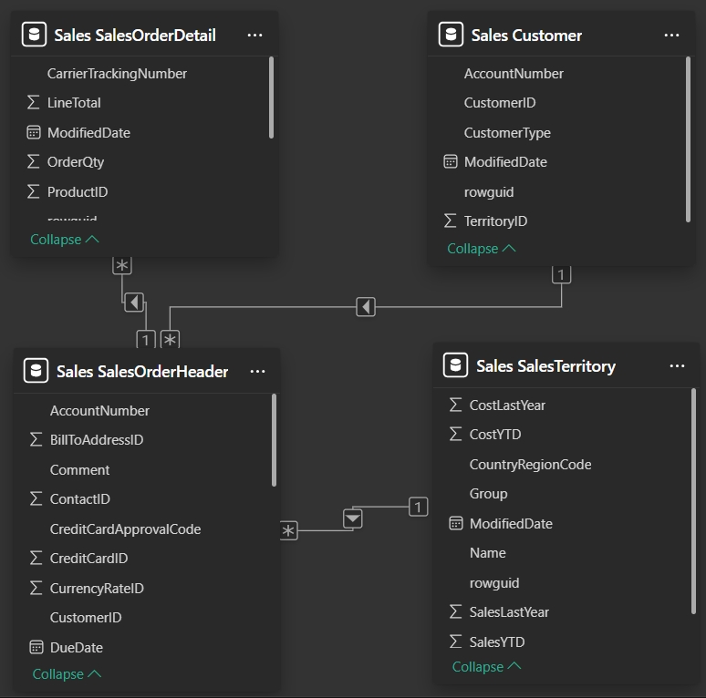
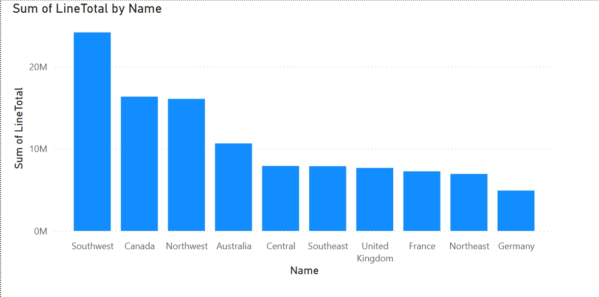

# 📊 AdvantureWorks Power BI Dashboard

This project showcases a sales analytics dashboard built in Power BI using data from AdventureWorks SQL Server sample database.

## 📁 Project Structure
- '/screenshots/' - ER diagram and charts
- 'adventureworks-sales-dashboard.pbix' - Power BI '.pbix' file with the full model and visuals
- 'README.md' - this file

## 🧩 ER Diagram
The data model is based on a subset of tables from the db, including tables Customers, SalesOrderHeader, SalesOrderDetail, SalesTerritory from the schema Sales. 
- Customer.CustomerID (1) -> SalesOrderHeader.CustomerID (∞). One to many: each customer can have multiple sales orders.
- SalesOrderHeader.SalesOrderID (1) -> SalesOrderDetail.SalesOrderID (∞). One to many: each order can have multiple line items.
- SalesTerritory.TerritoryID (1) -> SalesOrderHeader.TerritoryID (∞). One to many: each territory is associated with many orders.
- Customer (∞) -> Territory (∞). Many to many: each customer can have multiple territories, as well as each territory can have multiple customers. This connection is resolved through the SalesOrderHeader table. 

## 📊 Sample Visual: Sales by Region
This visual shows total sales amount ('LineTotal') grouped by region ('SalesTerritory.Name')

## 🚀 How to run

1. Open the 'adventureworks-sales-dashboard.pbix' file in Power BI Desctop
2. Connect to your AdventureWorks database

## Author
Anna Nesterova | [GitHub](https://github.com/annanesta)