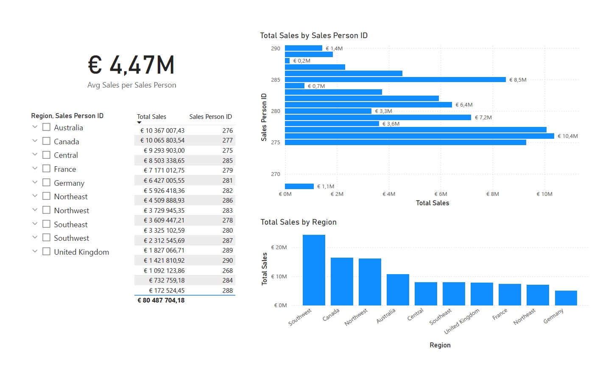
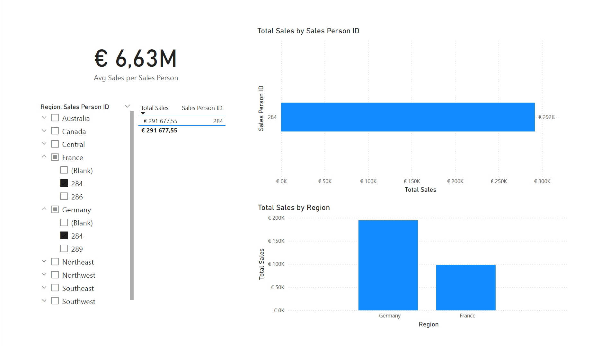
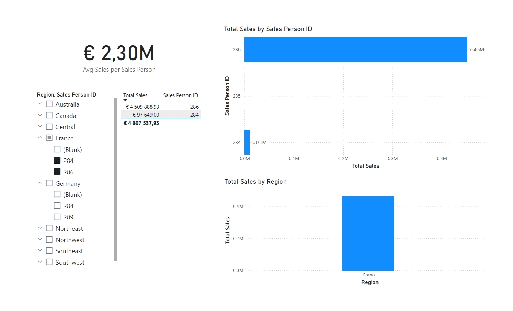

# 📊 AdventureWorks Power BI Dashboard

This project showcases a sales analytics dashboard built in Power BI using data from AdventureWorks SQL Server sample database.

## 📁 Project Structure
- '/screenshots/' - ER diagram and dashboards
- 'adventureworks-sales-dashboard.pbix' - Power BI '.pbix' file with the full model and visuals
- 'adventureworks-sales-dashboard.pdf' - '.pdf' file of the dashboards over view
- 'README.md' - this file

## 🧩 ER Diagram
The data model is based on a subset of tables from the db, including tables Customers, SalesOrderHeader, SalesOrderDetail, SalesTerritory from the schema Sales. 
- Customer.CustomerID (1) -> SalesOrderHeader.CustomerID (∞). One to many: each customer can have multiple sales orders.
- SalesOrderHeader.SalesOrderID (1) -> SalesOrderDetail.SalesOrderID (∞). One to many: each order can have multiple line items.
- SalesTerritory.TerritoryID (1) -> SalesOrderHeader.TerritoryID (∞). One to many: each territory is associated with many orders.
- Customer (∞) -> Territory (∞). Many to many: each customer can have multiple territories, as well as each territory can have multiple customers. This connection is resolved through the SalesOrderHeader table. 

## 💼 The Executive Dashboard
This executive dashboard presents high-level KPIs and tracks overall sales performance over time.
### The KPIs include:
- **Total sales** - the total revenue generated from all orders
- **Sales Involving a Salesperson** - revenue from orders handled by assigned salesperson
- **% Sales with Assigned Salesperson** - the share of sales that involved a salesperson
The line chart below shows the overall trend in sales from 2001 to 2004.

### Key insights:
- Around **73%** of all sales revenue was generated through orders involving a saleperson, indicating a strong reliance on the sales team.
- Sales show a generally **stable trend with minor fluctuations**, with a slight decrease in later periods.
- There may be opportunities to analyze the remaining 27% of sales that occur without saleperson  - e.g. self-service, online channels or store-driven purchases.

## 💼 The Operational Dashboard
This operational dashboard presents a current snapshot of sales performance by regions and salesperson. It includes a KPI showing **the average total sales per sales person** and allows interactive filtering by both region and sales person. 
By using the **slicer controls**, viewers can explore the data across different countries and compare individual sales people within or across regions.
### Charts:
- **Total Sales by Sales Person ID** - revenue generated by each sales person
- **Total Sales by Region** - revenue generated in each region
Below are examples of different filtered views:
- **Initial dashboard view**

- **Sales performance of a single sales perso across multiple regions**

- **Comparision of different sales people within a single region**

### Dashboard insights:
- Sales person **№284** generated nearly **2x more revenie in Germany than in France**.
- In France, the revenue from **sales person №284** is **45x lower** than in from **sales person №286**, indicationg strong variation in regional effectiveness.
- Total revenue in Germany is approximately **one-third lower** than in France. 

## 🚀 How to run

1. Open the 'adventureworks-sales-dashboard.pbix' file in Power BI Desctop
2. Connect to your AdventureWorks database

## Author
Anna Nesterova | [GitHub](https://github.com/annanesta)