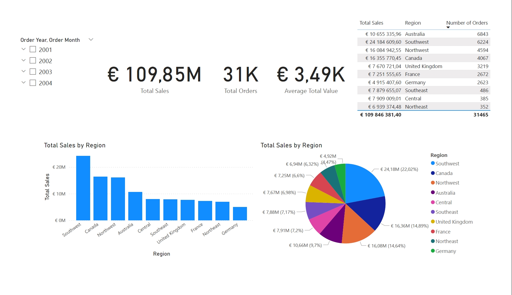
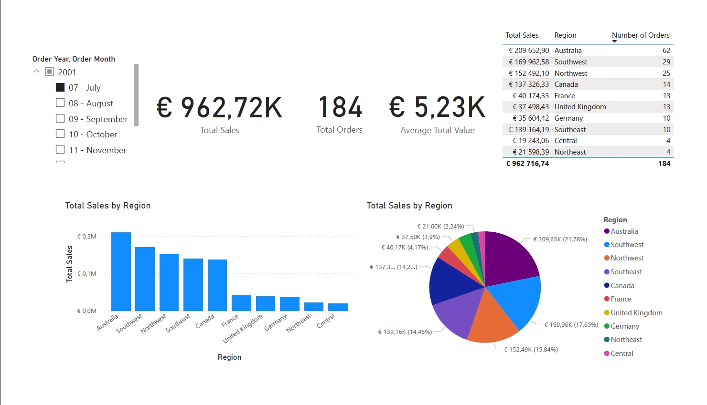
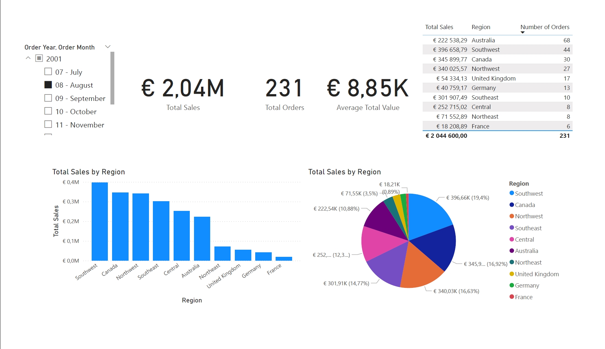

# 📊 AdventureWorks Power BI Dashboard

This project showcases a sales analytics dashboard built in Power BI using data from AdventureWorks SQL Server sample database.

## 📁 Project Structure
- '/screenshots/' - ER diagram and dashboards
- 'adventureworks-sales-dashboard.pbix' - Power BI '.pbix' file with the full model and visuals
- 'adventureworks-sales-dashboard.pdf' - '.pdf' file of the dashboards over view
- 'README.md' - this file

## 📚 Table of Contents
- [ER Diagram] (#-er-diagram)
- [Executive Dashboard] (#-executive-dashboard)
- [Operational Dashboard] (#-operational-dashboard)
- [Tactical Dashboard] (#-tactical-dashboard)

## 🧩 ER Diagram
The data model is based on a subset of tables from the db, including tables Customers, SalesOrderHeader, SalesOrderDetail, SalesTerritory from the schema Sales. 
- Customer.CustomerID (1) -> SalesOrderHeader.CustomerID (∞). One to many: each customer can have multiple sales orders.
- SalesOrderHeader.SalesOrderID (1) -> SalesOrderDetail.SalesOrderID (∞). One to many: each order can have multiple line items.
- SalesTerritory.TerritoryID (1) -> SalesOrderHeader.TerritoryID (∞). One to many: each territory is associated with many orders.
- Customer (∞) -> Territory (∞). Many to many: each customer can have multiple territories, as well as each territory can have multiple customers. This connection is resolved through the SalesOrderHeader table. 

[🔝Back to top](#-table-of-contents)

## 💼 Executive Dashboard
This executive dashboard presents high-level KPIs and tracks overall sales performance over time.
### The KPIs include:
- **Total sales** - the total revenue generated from all orders
- **Sales Involving a Salesperson** - revenue from orders handled by assigned salesperson
- **% Sales with Assigned Salesperson** - the share of sales that involved a salesperson
The line chart below shows the overall trend in sales from 2001 to 2004.

### Key insights:
- Around **73%** of all sales revenue was generated through orders involving a saleperson, indicating a strong reliance on the sales team.
- Sales show a generally **stable trend with minor fluctuations**, with a slight decrease in later periods.
- There may be opportunities to analyze the remaining 27% of sales that occur without saleperson  - e.g. self-service, online channels or store-driven purchases.
[🔝Back to top](#-table-of-contents)

## 💼 Operational Dashboard
This operational dashboard presents a current snapshot of sales performance by regions and salesperson. It includes a KPI showing **the average total sales per sales person** and allows interactive filtering by both region and sales person. 
By using the **slicer controls**, viewers can explore the data across different countries and compare individual sales people within or across regions.
### Charts:
- **Total Sales by Sales Person ID** - revenue generated by each sales person
- **Total Sales by Region** - revenue generated in each region
Below are examples of different filtered views:
- **Initial dashboard view**

- **Sales performance of a single sales perso across multiple regions**

- **Comparision of different sales people within a single region**

### Dashboard insights:
- Sales person **№284** generated nearly **2x more revenue in Germany than in France**.
- In France, the revenue from **sales person №284** is **45x lower** than in from **sales person №286**, indicationg strong variation in regional effectiveness.
- Total revenue in Germany is approximately **one-third lower** than in France. 
[🔝Back to top](#-table-of-contents)

## 💼 Tactical Dashboard
This tactical dashboard presents a snapshot of sales performance across regions over different time periods. 
It includes three KPIs:
- **Total Sales** - the revenue generated during the selected period
- **Total Orders** - number of orders placed in the selected period
- **Average Total Value** - calculated as total sales divided by number of orders
The time period can be changed using iteractive **date slicer controls**, allowing a flexible view of monthly dynamics.
### Charts:
- **KPI Cards** - high-level metrics of the selected period
- **Sales and Orders by Region (Table)** - detailed table showing revenue and number of orders per region
- **Sales by Region (Bar Chart)** - vertical bar chart comparing revenue across regions
- **Sales by Region (Pie Chart)** - share of total sales by region
Below are examples of different filtered views:
- **Initial dashboard view**

- **Sales performance in July 2001**

- **Sales performance in August 2001**

### Dashboard insights:
- **Total sales increased by approximtely 112%**, from $962.7K in July to $2.04M in August, nearly doubling monthly revenue.
- **The number of orders grew by 25.5%**, from 184 in July to 231 in August.
- **Average order value (AOV)** rose by **approximately 69.2%**, indicating a significant increase in per-transaction revenue.
- **Southwest** and **Northwest** were the leading regions in both months. **Canada** entered the top 3 in August, displacing **Australia**.
- The growth in August appears to be driven more by **increasing average order value** than slovely by value. 
[🔝Back to top](#-table-of-contents)

## 🚀 How to run

1. Open the 'adventureworks-sales-dashboard.pbix' file in Power BI Desctop
2. Connect to your AdventureWorks database

## Author
Anna Nesterova | [GitHub](https://github.com/annanesta)